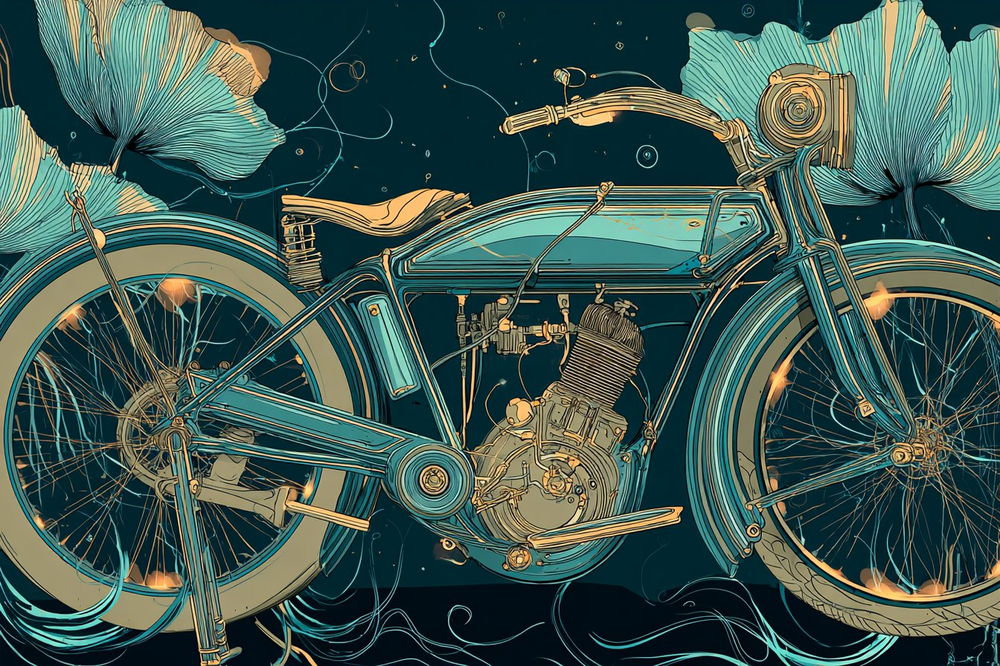
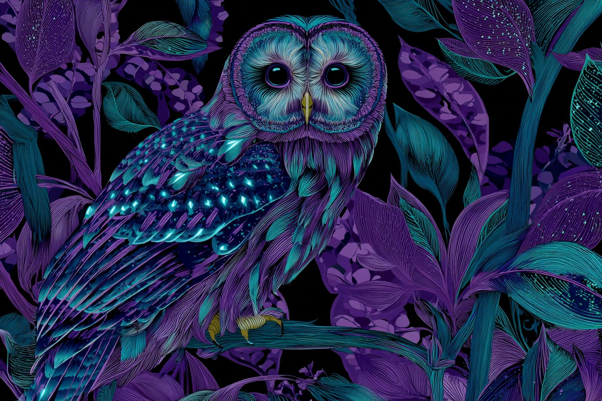
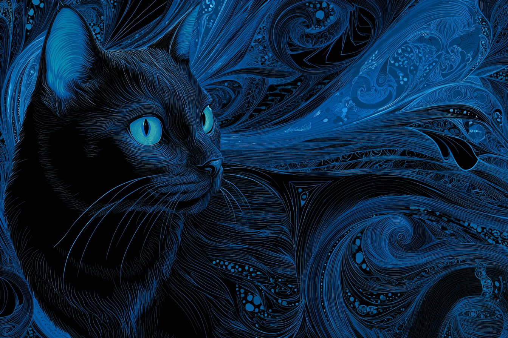
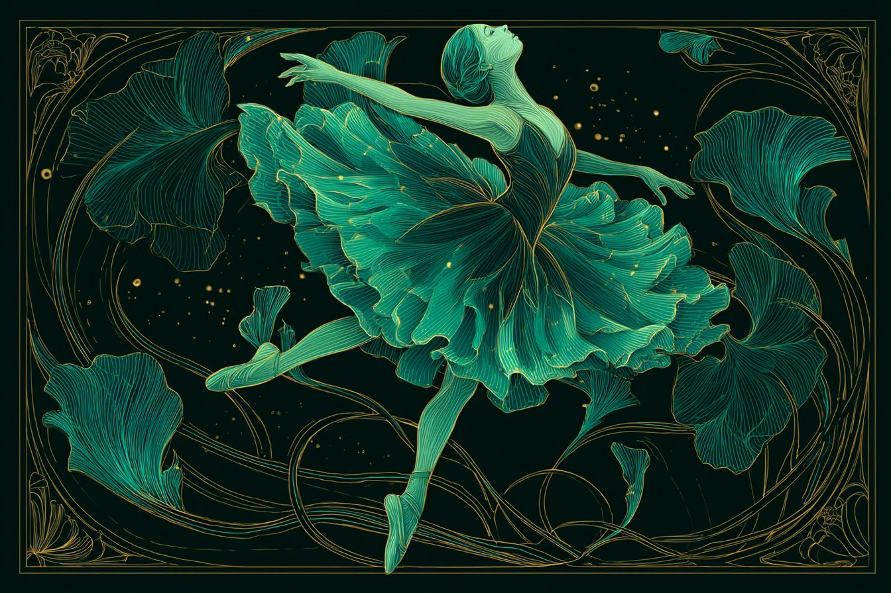

## 霓虹新艺术风格挂毯：优雅流畅的有机线条与发光效果
- **编号**: 案例001
- **来源**: X / LudovicCreator
- **链接**: https://x.com/LudovicCreator/status/1985602951952445475
- **日期**: 2025-11-05
- **分类**: 图片,创意,数字艺术,设计,灵感,图片

### 内容摘要
本作品以霓虹控制论挂毯为灵感，融合新艺术风格的优雅线条、有机形态和发光点缀，采用受色彩启发的调色板，展现出精致且高雅的视觉效果。

### 🇨🇳 中文内容
霓虹控制论挂毯   

提示：

[主题] 以霓虹灯新艺术风格优雅的风格描绘，具有流畅的线条、有机的形式和发光的点缀。使用受 [COLOR1] 和 [COLOR2] 启发的调色板来唤起精致和优雅的感觉

检查 ALTS

### 🇺🇸 英文内容
NEON CYBERNETIC TAPESTRY 

Prompt :

[SUBJECT] depicted in the style of Neon Art Nouveau Elegance, with flowing lines, organic forms, and glowing accents. Use a color palette inspired by [COLOR1] and [COLOR2] to evoke a sense of sophistication and grace

Check ALTS

### 相关图片

---

## 美貌的力量与诅咒：QT皇家之火的寓意探析
- **编号**: 案例002
- **来源**: X / Mutaz Ghunaim
- **链接**: https://x.com/abuzaki1978/status/1985920256007651505
- **日期**: 2025-11-05
- **分类**: 视频,创意,灵感,设计

### 内容摘要
这篇推文通过比喻金子从愤怒中滴落，探讨美貌是否是她的武器还是诅咒，表现了外表与内心的复杂关系，具有深刻的象征意义。

### 🇨🇳 中文内容
QT 皇家之火   
金子从她的愤怒中滴落。
美貌是她的武器还是诅咒？

### 🇺🇸 英文内容
QT royal fire 
Gold drips from her wrath.
Is beauty her weapon or curse?

### 相关视频
<video width="100%" controls><source src="../videos/tweet-1985920256007651505-1.mp4" type="video/mp4"></video>

---

## 中周问候：天使队与恶魔队的精彩问候
- **编号**: 案例003
- **来源**: X / SimoneSarantuya Ⓥ
- **链接**: https://x.com/SarantuyaSimone/status/1986035119900246298
- **日期**: 2025-11-05
- **分类**: 视频,创意,社交媒体,灵感

### 内容摘要
这条推文向大家传达了中周的祝福，采用天使队与恶魔队的比喻，营造出趣味十足的氛围，带来一份别样的中周问候。

### 🇨🇳 中文内容
天使队和恶魔队  向周  中致以问候

### 🇺🇸 英文内容
GM Angels and Demons  greetings to middle of the week GM

---

## Red Bull Ad Concept made with Veo 3 fast on @BasedLabsAIJSON Prompt:{  "description": "8-second
- **编号**: 案例004
- **来源**: X / Mr Das
- **链接**: https://x.com/MrDasOnX/status/1985670098716410056
- **日期**: 2025-11-06
- **分类**: 视频

### 🇨🇳 中文内容
广告概念与 Veo 3 一起制作，在 @BasedLabsAI 上快速发布

JSON 提示：

{
“description”： “红牛的 8 秒逼真电影视频可以以能量、火花和液体在半空中形成动态翅膀的爆发而打开。

“style”： “逼真的电影，

### 🇺🇸 英文内容
Red Bull Ad Concept made with Veo 3 fast on @BasedLabsAI

JSON Prompt:

{
  "description": "8-second photorealistic cinematic video of a Red Bull can open with a burst of energy, sparks and liquid forming dynamic wings in mid-air.",

  "style": "photorealistic cinematic,Red Bull

---

## Red Bull Ad Concept made with Veo 3 fast on @BasedLabsAIJSON Prompt:{  "description": "8-second
- **编号**: 案例005
- **来源**: X / Mr Das
- **链接**: https://x.com/MrDasOnX/status/1985670098716410056
- **日期**: 2025-11-06
- **分类**: 视频

### 完整内容
Red Bull Ad Concept made with Veo 3 fast on @BasedLabsAI

JSON Prompt:

{
  "description": "8-second photorealistic cinematic video of a Red Bull can open with a burst of energy, sparks and liquid forming dynamic wings in mid-air.",

  "style": "photorealistic cinematic,Red Bull 广告概念与 Veo 3 一起制作，在 @BasedLabsAI 上快速发布

JSON 提示：

{
“description”： “红牛的 8 秒逼真电影视频可以以能量、火花和液体在半空中形成动态翅膀的爆发而打开。

“style”： “逼真的电影，

---

## Midjourney Video V1 + Style Reference V7I found a stylized cartoon surrealism style with bold shap
- **编号**: 案例006
- **来源**: X / Morph
- **链接**: https://x.com/Morph_VGart/status/1985443962526830828
- **日期**: 2025-11-06
- **分类**: 视频

### 🇨🇳 中文内容
--sref 46096825中途视频 V1 + 风格参考 V7

我发现了一种风格化的卡通超现实主义风格，具有大胆的形状、富有表现力的面孔和绘画般的灯光，灵感来自现代 2D 动画和独立电影艺术。
--sref 46096825

### 🇺🇸 英文内容
Midjourney Video V1 + Style Reference V7

I found a stylized cartoon surrealism style with bold shapes, expressive faces, and painterly lighting inspired by modern 2D animation and indie film art.

---

## Your AI product photos look great until you zoom in on the text...The example below uses the same 
- **编号**: 案例007
- **来源**: X / rob - comfyui
- **链接**: https://x.com/hellorob/status/1985753933974028556
- **日期**: 2025-11-06
- **分类**: 视频

### 完整内容
Your AI product photos look great until you zoom in on the text...

The example below uses the same input image, model and LoRA… the only difference? The workflow.

Upscale input → Crop and diffuse ONLY the product → Paste it back

FREE workflow and tips below 您的 AI 产品照片看起来很棒，直到您放大文本......

下面的示例使用相同的输入图像、模型和 LoRA...唯一的区别是什么？工作流程。

高档输入→ 仅裁剪和扩散产品 → 将其粘贴回来

免费工作流程和以下  提示

### 相关视频
<video width="100%" controls><source src="../videos/tweet-1985753933974028556-1.mp4" type="video/mp4"></video>

---

## This is Qwen-Image-2509-MultipleAnglesYou can now change the camera position of your input image.
- **编号**: 案例008
- **来源**: X / Angry Tom
- **链接**: https://x.com/AngryTomtweets/status/1986030251227685208
- **日期**: 2025-11-06
- **分类**: 图片

### 🇨🇳 中文内容
您现在可以更改输入图像的相机位置。

自上而下、低角度、缩小或 45°–90° 旋转视图，全部来自单个图像。

Hugging Face  上提供免费演示

### 🇺🇸 英文内容
This is Qwen-Image-2509-MultipleAngles

You can now change the camera position of your input image.

Top-down, low-angle, zoomed-out or 45°–90° rotated views, all from a single image.

Free demo available on Hugging Face这是 Qwen-Image-2509-MultipleAngles

### 相关图片

---

## Loved this generation with Grok Video, animation and soundUsed a Midjourney image and animated wit
- **编号**: 案例009
- **来源**: X / LudovicCreator
- **链接**: https://x.com/LudovicCreator/status/1986055981550252100
- **日期**: 2025-11-06
- **分类**: 视频

### 完整内容
Loved this generation with Grok Video, animation and sound

Used a Midjourney image and animated without prompt

@grok imagine喜欢这一代的 Grok 视频、动画和声音

使用中途图像并在没有提示的情况下制作动画

@grok 想象

### 相关视频
<video width="100%" controls><source src="../videos/tweet-1986055981550252100-1.mp4" type="video/mp4"></video>

---

## 字节跳动开源AI视频模型BindWeave 实现多角色主题一致
- **编号**: 案例010
- **来源**: X / Gorden Sun
- **链接**: https://x.com/Gorden_Sun/status/1986024143771545921
- **日期**: 2025-11-06
- **分类**: 视频,AI,视频,工具,资源,数字艺术

### 内容摘要
ByteDance推出的开源AI视频模型BindWeave，支持多角色同时作为参考，确保视频中的主体保持一致，提升视频生成的连贯性与质量。项目地址已开放。

### 🇨🇳 中文内容
保持主题一致性的开源视频模型
字节跳动的开源 AI 视频模型，保持主题一致性，支持同时使用多个角色作为参考。
项目地址：https:// lzy-dot.github.io/BindWeave/
型号：https:// huggingface.co/ByteDance/Bind 编织 ...

### 🇺🇸 英文内容
BindWeave: Open-Source Video Model That Maintains Subject Consistency
ByteDance's open-source AI video model that maintains subject consistency, supporting the use of multiple characters as references simultaneously.
Project Address: https://lzy-dot.github.io/BindWeave/
Model: https://huggingface.co/ByteDance/BindWeave…BindWeave：

### 相关视频
<video width="100%" controls><source src="../videos/tweet-1986024143771545921-1.mp4" type="video/mp4"></video>

---

## Veo 3.1与Veo 3对比：未来派摩托车组装动画初体验
- **编号**: 案例011
- **来源**: X / Amira Zairi
- **链接**: https://x.com/azed_ai/status/1986071279317999882
- **日期**: 2025-11-06
- **分类**: 视频,动画,特效,3D,数字艺术,创意

### 内容摘要
本文分享使用Veo 3.1 Fast在LeonardoAi平台制作的高质量工业动画，通过详细的场景、特效和配乐，展示未来派摩托车从零件飞入到组装完成的过程，旨在比较两个版本的表现差异。

### 完整内容
Trying this old Prompt with Veo 3.1 to compare with Veo 3. Let me know what you think!尝试使用 Veo 3.1 进行此旧提示，以与 Veo 3 进行比较。让我知道你的想法！I used Veo 3.1 Fast on @LeonardoAi  / 1080p
JSON prompt:我在 @LeonardoAi / 1080p  上使用了 Veo 3.1 Fast
JSON 提示：{
  "shot": {
    "composition": "wide shot centered at eye level, capturing the full view of the factory floor and the assembling motorbike",
    "lens": "35mm",
    "frame_rate": "24fps",
    "camera_movement": "static"
  },{
“射击”： {
“composition”：“以视线水平为中心的广角镜头，捕捉工厂车间和组装摩托车的全貌”，
“lens”： “35mm”，
“frame_rate”： “24fps”，
“camera_movement”： “静态”
  },  "subject": {
    "description": "a futuristic, strong motorbike assembling itself from scattered parts",
    "wardrobe": "",
    "props": "mechanical parts, gears, wires, pistons, body panels, wheels"
  },“主题”： {
“description”： “一辆未来派、坚固的摩托车，由分散的零件组装而成”，
“衣柜”： “”，
“props”： “机械零件、齿轮、电线、活塞、车身面板、车轮”
  },  "scene": {
    "location": "large, clear industrial factory floor",
    "time_of_day": "midday",
    "environment": "shiny, clean surfaces with strong light and dramatic shadows; the atmosphere is warm and filled with subtle ambient haze"
  },“场景”： {
“location”： “大而清晰的工业厂房”，
“time_of_day”： “中午”，
“环境”：“闪亮、干净的表面，具有强烈的光线和戏剧性的阴影;气氛温暖，充满了微妙的环境阴霾”
  },  "visual_details": {
    "action": "motorbike parts fly in from all directions, clicking and locking into place to form a complete, sleek vehicle",
    "special_effects": "electric zaps, soft glows, heat distortion waves rising from the exhaust",
    "hair_clothing_motion": ""
  },“visual_details”： {
“action”： “摩托车零件从四面八方飞来，咔哒一声并锁定到位，形成一辆完整、时尚的车辆”，
“special_effects”：“电击声，柔和的光芒，从排气中升起的热扭曲波”，
“hair_clothing_motion”： “”
  },  "cinematography": {
    "lighting": "bright overhead industrial lighting with sharp contrast, emphasizing form and texture",
    "color_palette": "warm tones with metallic highlights and soft amber reflections",
    "tone": "epic and intense, emphasizing mechanical precision and power"
  },“电影摄影”： {
“lighting”：“明亮的头顶工业照明，对比鲜明，强调形式和纹理”，
“color_palette”：“带有金属亮点和柔和琥珀色反射的暖色调”，
“tone”：“史诗般而激烈，强调机械精度和力量”
  },  "audio": {
    "music": "minimalist, deep synthetic pulses that build with the assembly",
    "ambient": "deep factory hum, subtle air movements",
    "sound_effects": "clicks, whirs, zaps, shinks, thuds, whooshes, crackles, hiss, rumble",
    "mix_level": "cinematic mix with prioritized effects and balanced music bed"
  },“音频”： {
“music”： “极简主义、深沉的合成脉冲，与组装一起构建”，
“ambient”：“深沉的工厂嗡嗡声，微妙的空气运动”，
“sound_effects”： “咔哒声、呼呼声、电击声、咔哒声、砰砰声、嗖嗖声、噼啪声、嘶嘶声、隆隆声”，
“mix_level”： “具有优先效果和平衡音乐床的电影混音”
  },  "dialogue": {
    "character": "",
    "line": "",
    "subtitles": false
  }
}“对话”： {
“字符”： “”，
“行”： “”，
“字幕”：false
  }
}

### 相关视频
<video width="100%" controls><source src="../videos/tweet-1986071279317999882-1.mp4" type="video/mp4"></video>

---

## 未来水下城市幻想场景，虚拟视觉特效精彩呈现
- **编号**: 案例012
- **来源**: X / LudovicCreator
- **链接**: https://x.com/LudovicCreator/status/1986180509429309585
- **日期**: 2025-11-06
- **分类**: 视频,创意,数字艺术,特效,3D,动画

### 内容摘要
这段描述展现了一座被淹没的未来城市，通过虚拟特效模拟水下光线、气泡和环境氛围，展现了丰富的视觉创意，适合数字艺术和动画爱好者欣赏。

### 🇨🇳 中文内容
提示：

一座淹没在水下的广阔城市。摩天大楼像珊瑚塔一样拔地而起。镜头穿过破碎的窗户和漂浮的汽车，阳光透过上方的表面。成群的鱼在空荡荡的办公大厅里游来游去。一阵气泡的低语经过一个发光的标志，该标志仍然在水下隐约闪烁。视觉特效：水下光焦散、体积雾、气泡轨迹、柔和折射效果。

@Kling_ai 制造

### 🇺🇸 英文内容
KLING 2.5  

Prompt :

A vast city submerged underwater. Skyscrapers rise like coral towers. The camera drifts through broken windows and floating cars, sunlight filtering through the surface above. Schools of fish swim through empty office halls. A whisper of bubbles trails past a glowing sign that still flickers faintly underwater. VFX: underwater light caustics, volumetric fog, bubble trails, soft refraction FX.

Made in   KLING 2.5

### 相关视频
<video width="100%" controls><source src="../videos/tweet-1986180509429309585-1.mp4" type="video/mp4"></video>

---

