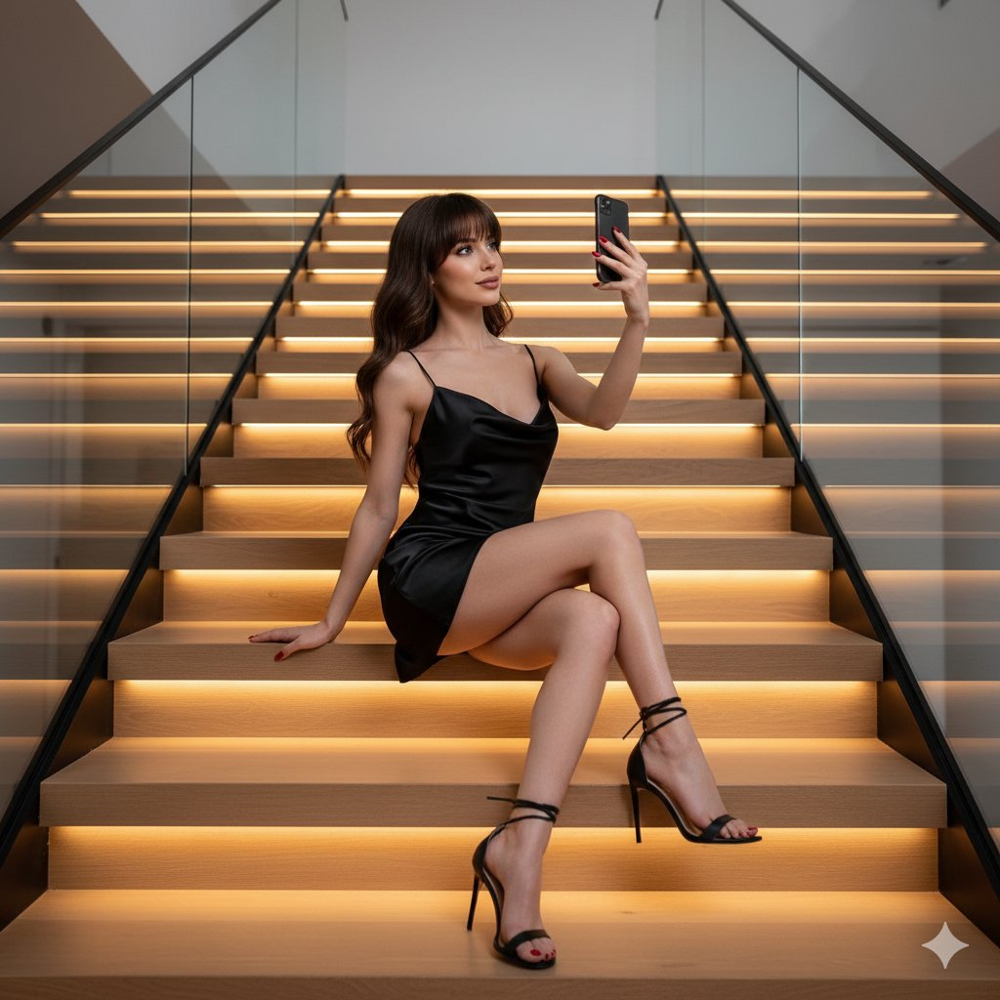

# 收藏内容

## 极致奢华时尚摄影：黑色缎面裙女性全身肖像
- **编号**: 案例001
- **来源**: X / Iqra Saifi
- **链接**: https://x.com/IqraSaifiii/status/1986495273749893620
- **日期**: 2025-11-06
- **分类**: 图片,Gemini,摄影,时尚,3D,高端

### 内容摘要
这组高端时尚摄影作品展现一位身穿黑色缎面迷你裙、优雅自拍的年轻女性，结合现代家居环境与专业灯光，呈现出逼真细腻的视觉效果，彰显奢华与艺术结合的极致美感。

### 🇨🇳 中文内容
{
“prompt”： “一位令人惊叹的年轻女性的全身高级时尚肖像。她身穿黑色缎面迷你吊带裙，垂坠式围巾领口和细细肩带，搭配黑色系带细高跟鞋。她有一头长长的波浪形黑发，留着浓密的刘海，化着微妙优雅的妆容。心情迷人而奢华。
“姿势”： {
“description”： “拍摄对象侧身坐在宽阔的浅色木质楼梯上。她的左腿交叉在右膝上，清楚地展示了细高跟凉鞋。她的右手（拿着一部深色智能手机）举到脸附近，积极地拍摄高角度自拍。她直视手机摄像头。
“keywords”： [“坐姿”、“盘腿”、“自拍姿势”、“优雅姿势”、“手拿手机”]
  },
“设置”： {
“environment”： “现代、简约的豪华家居内饰。背景有一个宽阔的对称楼梯，由浅色木材（例如枫木或橡木）制成，踏板由温暖的线性 LED 灯单独背光。由黑色金属柱固定的透明玻璃栏杆构成了拍摄对象。
“aesthetic”： “建筑，现代设计，简洁的线条。”
  },
“相机”： {
“shot_type”： “全身人像拍摄”，
“angle”： “略低的角度（蠕虫的视角）以强调她的身高和楼梯的结构。
“lens”： “85mm 定焦镜头”，
“depth_of_field”： “浅景深，主体清晰对焦，背景元素（栏杆、远处台阶）略微柔化。
“composition”： “主题在画面内完美居中。
  },
“照明”： {
“key_light”： “左前方柔和的漫射工作室灯（柔光箱），为她的脸部和皮肤提供讨人喜欢的平滑照明。
“accent_light”： “戏剧性的、温暖的 （3000K） 线性底光直接内置在木制楼梯踏板中，创造出定义背景的水平发光线。
“shadows”： “中等对比度，清晰的阴影，仍然保留了黑色连衣裙的细节。
“exposure”： “完美暴露，强调缎面材料的光泽。
  },
“style_and_quality”： {
“style”： “编辑时尚摄影 |电影现实主义 |亲密“，
“details”： [“高保真缎面纹理”、“玻璃栏杆上的倒影”、“修剪整齐的红色指甲”、“完美无瑕的肌肤纹理”]，
“quality”： [“8K 分辨率”、“杰作”、“超细节”、“逼真”]
  }

### 🇺🇸 英文内容
Nano banana in @GeminiApp {
  "prompt": "A full-body, high-fashion portrait of a stunning young woman. She is wearing a black satin mini slip dress with a draped cowl neckline and thin spaghetti straps, paired with black strappy stiletto high-heels. She has long, wavy dark hair with full bangs and subtle, elegant makeup. The mood is glamorous and luxurious.",
  "pose": {
    "description": "The subject is sitting sideways on a wide, light-wood stair step. Her left leg is crossed over her right knee, clearly showcasing the stiletto sandals. Her right hand (holding a dark smartphone) is lifted near her face, actively taking a high-angle selfie. She is looking directly at the phone camera.",
    "keywords": ["sitting pose", "crossed legs", "selfie pose", "elegant posture", "hand holding phone"]
  },
  "setting": {
    "environment": "Modern, minimalist luxury home interior. The background features a wide, symmetrical staircase made of light-colored wood (e.g., maple or oak) with treads that are individually backlit by warm linear LED lights. Clear glass railings secured by black metal posts frame the subject.",
    "aesthetic": "Architectural, contemporary design, clean lines."
  },
  "camera": {
    "shot_type": "Full-Body Portrait Shot",
    "angle": "Slightly low angle (worm's-eye view) to emphasize her height and the structure of the staircase.",
    "lens": "85mm prime lens",
    "depth_of_field": "Shallow DoF, with the subject in crisp focus and the background elements (railings, far steps) slightly softened.",
    "composition": "The subject is perfectly centered within the frame."
  },
  "lighting": {
    "key_light": "Soft, diffused studio light (softbox) from the front-left, providing flattering, smooth illumination on her face and skin.",
    "accent_light": "Dramatic, warm (3000K) linear under-lighting built directly into the wooden stair treads, creating horizontal lines of glow that define the background.",
    "shadows": "Medium contrast, well-defined shadows that still preserve detail in the black dress.",
    "exposure": "Perfectly exposed, emphasizing the sheen of the satin material."
  },
  "style_and_quality": {
    "style": "Editorial Fashion Photography | Cinematic Realism | Intimate",
    "details": ["High-fidelity satin texture", "Reflections on glass railings", "Manicured red fingernails", "Flawless skin texture"],
    "quality": ["8K resolution", "masterpiece", "hyper-detailed", "photorealistic"]
  }

### 相关图片

---

