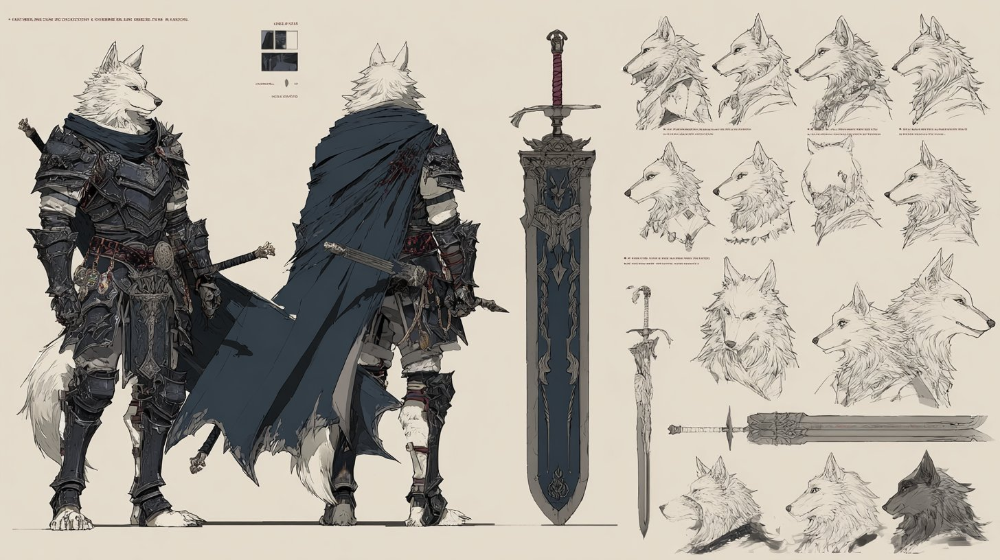
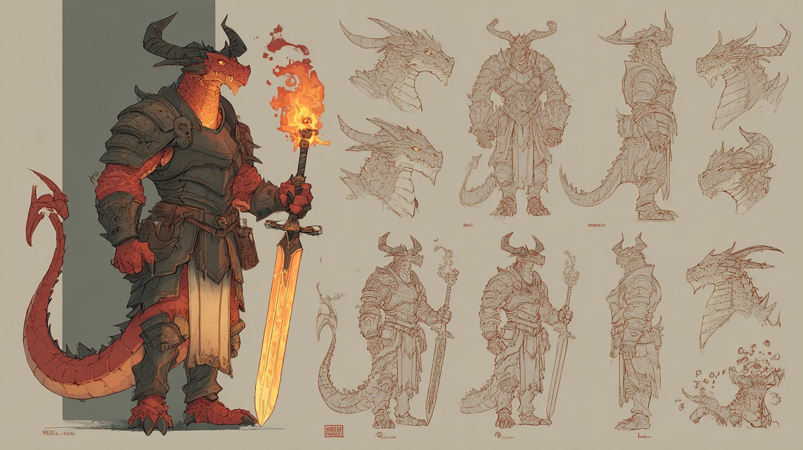
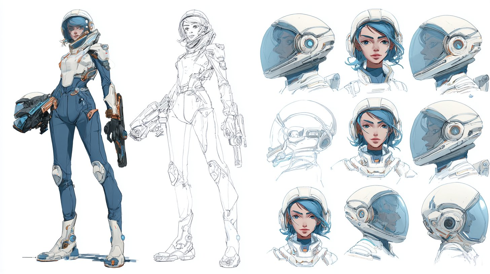
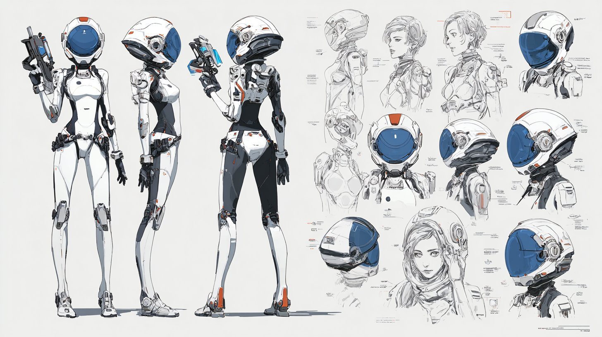

# 收藏内容

## 角色设计表模板：全身多姿势高细节渲染指南
- **编号**: 案例001
- **来源**: X / Pierrick Chevallier | IA
- **链接**: https://x.com/CharaspowerAI/status/2040466942805360648
- **日期**: 2026-04-07
- **分类**: 设计,创意,灵感,数字艺术

### 内容摘要
可直接用于生成角色设定表的提示模板，包含全身、多姿势与表情、服装与物件细节，以及超高分辨率与特定艺术风格渲染要求。

### 中文内容
角色设计表 [
角色描述及服装+对象]的提示角色设计表，概念
艺术，包含全身。多种姿势和表情，
细节精细，极高分辨率渲染，
采用[特定艺术风格]。

### 英文内容
PromptShare
Character design sheet
PROMPT
character design sheet for an [character description with outfit + object],
concept art, featuring a full-body. multiple poses and expressions,
with intricate details and an ultra-detailed, high-resolution rendering,
in a [specific art style].PromptShare

### 相关图片

---

